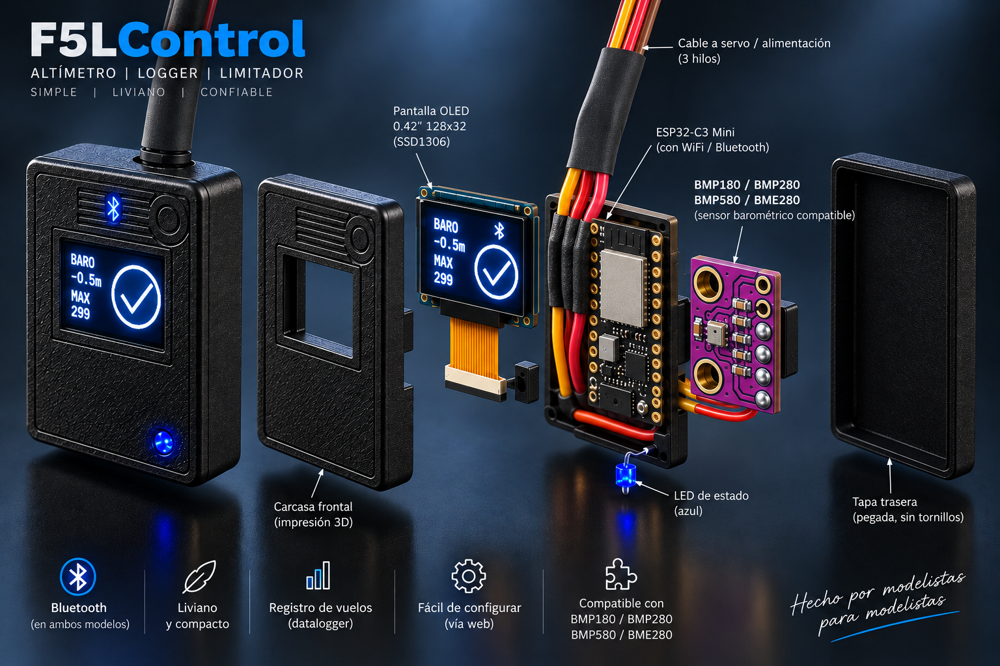
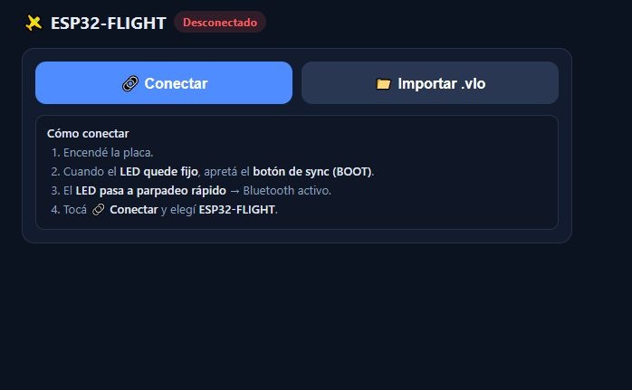
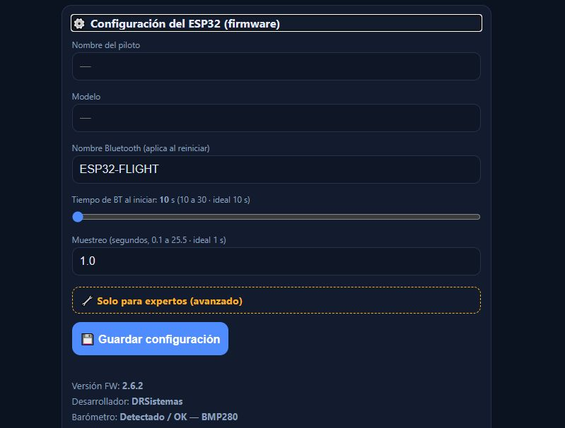
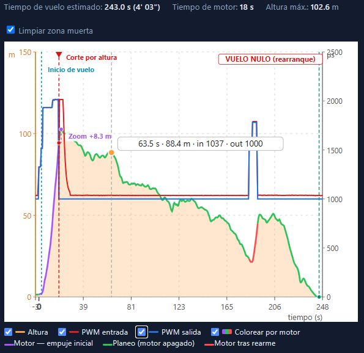
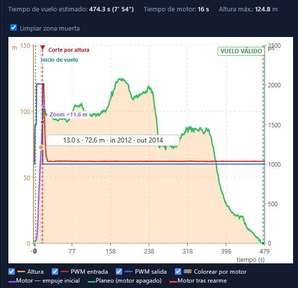
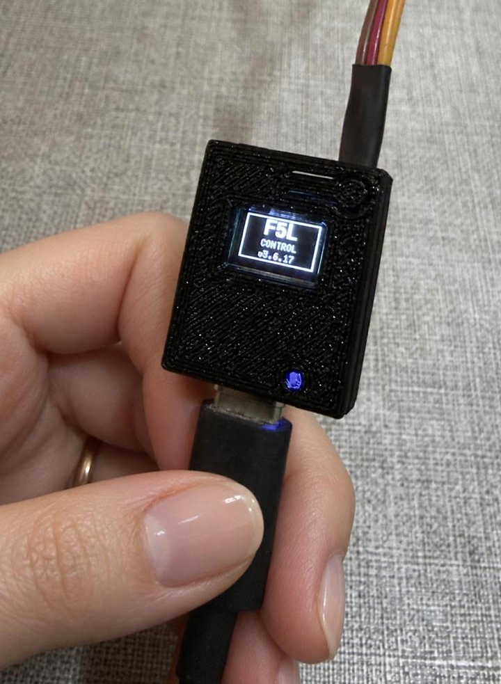
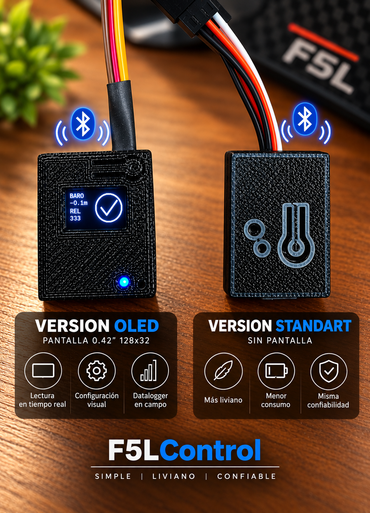

  

  
  
  
  
  

# F5LControl - Limitador F5L con ESP32-C3

**F5LControl** es un sistema limitador y datalogger para aeromodelismo en la categoría **F5L**, desarrollado sobre **ESP32-C3 Super Mini**.

El proyecto nació con el objetivo de disponer de un equipo **simple, económico y liviano**, capaz de controlar los parámetros de vuelo establecidos para F5L y, al mismo tiempo, registrar la información necesaria para poder **consultar y verificar el vuelo posteriormente**.

---

## Índice

- [Características](#características)
- [El sistema](#el-sistema)
- [Versión actual](#versión-actual)
- [Instalación](#instalación)
- [Uso básico](#uso-básico)
- [Modo Bluetooth](#modo-bluetooth)
- [Indicaciones del LED](#indicaciones-del-led)
- [Indicaciones de la pantalla (OLED)](#indicaciones-de-la-pantalla-oled)
- [Datos guardados en cada vuelo](#datos-guardados-en-cada-vuelo)
- [Hardware](#hardware)
- [Seguridad](#seguridad)
- [Categoría F5L](#categoría-f5l)
- [Carcasa 3D](#carcasa-3d)
- [Imágenes](#imágenes)
- [Tiempo estimado de grabación](#tiempo-estimado-de-grabación)
- [Apoyá el proyecto](#apoyá-el-proyecto)
- [Contacto y soporte](#contacto-y-soporte)
- [Agradecimientos](#agradecimientos)
- [Autor](#autor)

---

## Características

- Corte de motor por altura.
- Corte de motor por tiempo.
- Registro de altura del vuelo.
- Registro de PWM de entrada desde receptor.
- Registro de PWM de salida hacia ESC.
- Descarga por Bluetooth BLE.
- Web de control sin instalar programas.
- Exportación de vuelos `.vlo` y CSV.
- Barra de uso de memoria.
- Compatible con BMP180/BMP280/BME280/BMP580.
- Carcasa imprimible en 3D.

---

## El sistema

**F5LControl está compuesto por dos partes principales:**

### Firmware

Es el software que se instala directamente en el **ESP32-C3** y se encarga del funcionamiento del dispositivo.

Entre sus funciones se encuentran:

* Control del limitador.
* Medición y registro de altura.
* Control de los parámetros de vuelo.
* Registro de vuelos.
* Almacenamiento de los datos para su posterior consulta.
* Comunicación con la interfaz Web Control.

### Web Control

Es la interfaz utilizada para comunicarse con el dispositivo y administrar **F5LControl** de una manera sencilla, sin necesidad de instalar software adicional.

Desde la Web Control es posible:

* Configurar los parámetros del dispositivo.
* Consultar el estado y la información del equipo.
* Acceder al **datalogger**.
* Visualizar los vuelos registrados.
* Analizar y verificar los datos de cada vuelo.

### Contenido del repositorio

Este repositorio público contiene todo lo necesario para instalar y utilizar **F5LControl**:

* Binarios del firmware listos para instalar.
* Web Control.
* Manuales de instalación y utilización.
* Imágenes y documentación del proyecto.
* Normativas relacionadas con F5L.
* Archivos **STL** para impresión 3D de la carcasa.

> **Nota:** el repositorio no incluye el código fuente del firmware.

---

## Versión actual

**VERSION FW:** 3.0.17  
**VERSION WEB:** 3.0.17

**Historial de cambios**
- [Historial de cambios del firmware](docs/history_FW.md)
- [Historial de cambios de la web](docs/history_WEB.md)

**¿Cómo actualizo?**

**FW:** seguir el manual de flasheo:  
[Manual_Flasheo_ESP32-C3.pdf](https://github.com/drsistemas01/F5LControl/blob/main/FW/Manual_Flasheo_ESP32-C3.pdf)

**WEB:** descargar el archivo `index.html`:  
[WebControl - descarga directa](https://github.com/drsistemas01/F5LControl/raw/main/WEB%20Control/index.html)

---

## Instalación

### Archivos

**Firmware:** los binarios están en la carpeta `FW/BIN` y el manual de instalación en `FW/Manual_Flasheo_ESP32-C3.pdf`.

**Web de control:** el archivo `WEB Control/index.html`. Abrir con Chrome o Edge compatible con Web Bluetooth.

### Flasheo

> **LEER ANTES DE FLASHEAR**
>
> Antes de conectar la placa o cargar los binarios, leer el manual de instalación del firmware:
>
> `FW/Manual_Flasheo_ESP32-C3.pdf`
>
> Ahí está explicado el paso a paso completo para instalar el FW correctamente.

Cargar los binarios en estas direcciones:

| Dirección | Archivo |
|---|---|
| `0x0` | `bootloader.bin` |
| `0x8000` | `partitions.bin` |
| `0x10000` | `firmware.bin` |

No activar:

- Secure Boot
- Flash Encryption
- Encrypt
- eFuse
- opciones de seguridad permanente

Para uso normal, solo hacer flasheo estándar.

### Qué permite la web

- conectar por Bluetooth BLE
- listar vuelos guardados
- descargar vuelos
- exportar vuelos `.vlo`
- exportar CSV
- ver gráfica de altura
- ver PWM de entrada y salida
- identificar corte de motor
- calcular zoom/inercia posterior al corte
- ver tiempo de vuelo en planeo
- ver uso de memoria
- borrar vuelos
- revisar configuración del firmware

---

## Uso básico

1. Encender la placa con la radio encendida y el acelerador al mínimo.
2. Durante el arranque (aproximadamente 2 segundos), el equipo calibra el mínimo del acelerador y el barómetro.
3. Si detecta barómetro OK, memoria OK, señal PWM válida y mínimo válido, entra en modo vuelo.
4. Si algo falla, entra en modo Bluetooth y muestra el motivo en la pantalla (ver Modo Bluetooth).
5. Para entrar a Bluetooth a propósito (bajar vuelos o configurar), encender con la radio apagada.

> El botón BOOT queda reservado y no interviene en el arranque.

---

## Modo Bluetooth

Para entrar en modo Bluetooth:

1. Encender la placa con la **radio apagada**.
2. Esperar que el LED (parpadeo rápido) o la pantalla (logo de Bluetooth) indiquen Bluetooth activo.
3. Abrir la web de control.
4. Presionar conectar.
5. Elegir el dispositivo ESP32-FLIGHT.

Desde la web se pueden descargar vuelos, revisar la configuración y ver los datos del receptor.

Cuando el equipo entra en modo Bluetooth, el modo vuelo queda bloqueado y el motor no puede arrancar desde el limitador. Para volver a modo vuelo, reiniciar la placa con la **radio encendida** y el acelerador al mínimo.

---

## Indicaciones del LED

| Estado | LED |
|---|---|
| Ventana de arranque | Parpadeo lento |
| Bluetooth activo esperando conexión | Parpadeo rápido |
| Bluetooth conectado | Patrón SOS |
| Vuelo normal | LED fijo |
| Hubo rearranque | Parpadeo rápido |

---

## Indicaciones de la pantalla (OLED)

Si el equipo tiene pantalla, muestra:

| Momento | Pantalla |
|---|---|
| Al encender | Logo **F5L / CONTROL** con la versión |
| Listo para volar | Barómetro y mínimo del acelerador + tilde de OK |
| En vuelo (con motor) | Apagada (se enciende sola al aterrizar) |
| Al terminar el vuelo | **VÁLIDO** o **NULO**, alternando **altura máxima** y **zoom** (trepada por inercia) |
| Modo Bluetooth | Logo de Bluetooth + nombre del equipo (**CONECTADO** al vincular la app) |
| Falla de arranque | **E1** sin barómetro · **E2** mínimo del acelerador fuera de rango · **E3** memoria |

La altura a la que la pantalla se enciende sola al aterrizar es configurable desde la web (3 m por defecto).

---

## Datos guardados en cada vuelo

Cada vuelo registra:

- tiempo
- altura
- PWM de entrada desde receptor
- PWM de salida hacia ESC
- motivo de corte

Los vuelos se guardan en memoria interna del ESP32-C3 y se descargan por Bluetooth desde la web.

---

## Hardware

### Placa usada

Placa recomendada:

**ESP32-C3 Super Mini con o sin pantalla OLED integrada**

Compatible con versiones con o sin pantalla.

La pantalla no es necesaria para el funcionamiento del limitador.

Características usadas:

- ESP32-C3
- 4 MB Flash
- USB nativo
- Bluetooth BLE
- GPIO con lógica de 3.3 V

### Pines

| Función | GPIO |
|---|---|
| Entrada PWM desde receptor | GPIO 3 por defecto. Configurable: GPIO 0, 1, 3, 4, 7 o 10 |
| Salida PWM hacia ESC | GPIO 4 por defecto. Configurable: GPIO 0, 1, 3, 4, 7 o 10 |
| SDA barómetro | GPIO 5 |
| SCL barómetro | GPIO 6 |
| LED de estado | GPIO 8 |
| Botón BOOT (reservado) | GPIO 9 |

Pines permitidos para entrada PWM y salida ESC desde configuración avanzada:

- GPIO 0
- GPIO 1
- GPIO 3
- GPIO 4
- GPIO 7
- GPIO 10

No usar el mismo pin para entrada PWM y salida ESC.

### Conexión básica

**Receptor RC**

| Receptor | ESP32-C3 |
|---|---|
| Señal PWM | GPIO configurado como entrada PWM, por defecto GPIO 3 |
| GND | GND |

La masa del receptor, ESC y ESP32-C3 debe estar en común.

**ESC**

| ESP32-C3 | ESC |
|---|---|
| GPIO configurado como salida ESC, por defecto GPIO 4 | Señal PWM |
| GND | GND |

**Barómetro**

Sensores soportados: BMP180, BMP280, BME280, BMP580. El firmware detecta automáticamente cuál está conectado al iniciar.

| Barómetro | ESP32-C3 |
|---|---|
| VCC | VCC |
| GND | GND |
| SDA | GPIO 5 |
| SCL | GPIO 6 |

### Receptores probados

Voy a ir actualizando esta lista con receptores probados.

Importante: no asumir que cualquier receptor es compatible. Un receptor solo debe conectarse directo si su salida PWM fue verificada en 3.3 V o menos. Si la salida PWM supera 3.3 V, puede dañar el ESP32-C3 y debe usarse adaptación de nivel.

| Marca | Modelo |
|---|---|
| CORONA | R4SF - R6SF - R8SF |
| FRSKY  | RX6R |

Si probaste un receptor, podés informar el resultado a **soporte.f5lcontrol@gmail.com** (marca y modelo, si funcionó, fallas encontradas y sugerencias).

---

## Seguridad

### Advertencia importante sobre PWM

La entrada PWM del receptor va directa al ESP32-C3.

> **ATENCION / CUIDADO**
>
> No todos los receptores son compatibles para conectarlos directo al ESP32-C3.
> Si el receptor entrega una señal PWM superior a 3.3 V, puede quemar el ESP32-C3.

**El pulso PWM del receptor NO debe superar 3.3 V.**

El ESP32-C3 no tolera 5 V en sus GPIO. Si se conecta una señal PWM de 5 V, o cualquier señal superior a 3.3 V, directamente al pin de entrada, se puede quemar la placa.

Algunos receptores entregan PWM a 3.3 V y otros pueden entregar PWM a 5 V. Antes de conectar cualquier receptor al limitador, hay que medir o verificar el nivel real de la señal PWM.

Antes de conectar un receptor:

1. Verificar el nivel de señal PWM.
2. Confirmar que el pulso sea de 3.3 V o menor.
3. No conectar señales PWM superiores a 3.3 V directo al ESP32-C3.
4. Si el receptor entrega PWM de 5 V, usar adaptación de nivel antes de conectarlo.

### Antes de volar

Realizar todas las pruebas de banco siempre **sin hélice**.

Antes de volar verificar:

- señal PWM máxima 3.3 V
- masa común entre receptor, ESC y ESP32-C3
- barómetro detectado
- respuesta correcta del ESC
- sentido correcto del acelerador
- funcionamiento del corte
- batería adecuada
- carcasa correctamente fijada

El uso en vuelo es responsabilidad del usuario.

---

## Categoría F5L

F5LControl está diseñado para trabajar con los parámetros usados en F5L.

| Requisito | Valor |
|---|---:|
| Corte por altura | 90 m |
| Corte por tiempo de motor | 30 s |
| Referencia de altura inicial | estabilizada durante la ventana inicial de 2 s |
| Registro posterior del vuelo | sí |
| Verificación posterior del vuelo | sí |
| Barómetro | BMP180/BMP280/BME280/BMP580 |
| Pantalla | Opcional |

El firmware fue diseñado y compilado para cumplir los requisitos funcionales solicitados por FAI/CIAM para esta categoría: limitación por altura/tiempo, registro de datos y posibilidad de verificación posterior.

> Nota: este repositorio no declara una homologación oficial. Para competencia formal, verificar siempre contra la normativa vigente publicada por FAI/CIAM.

Referencia: [FAI Sporting Code - Aeromodelling / CIAM](https://www.fai.org/page/sporting-code)

**Normativas:** la carpeta `NORMATIVAS` incluye documentación de referencia relacionada con F5L y especificaciones del sistema.

---

## Carcasa 3D

Carpeta: `CARCASAS/STL`

Archivos incluidos:

Version sin Pantalla
- `CASE_SIN_LCD_BASE.stl`
- `CASE_SIN_LCD_TAPA.stl`

Version Con Pantalla
- `CASE_OLED_BASE.stl`
- `CASE_OLED_TAPA.stl`

---

## Imágenes

### Web de control

### Gráficas

### Carcasa

Version OLED

Version Sin Pantalla

---

## Tiempo estimado de grabación

Los siguientes valores son estimativos. El tiempo real puede variar según la memoria libre disponible, la cantidad de vuelos guardados, el formato interno del archivo y el uso del sistema de archivos.

La tabla está calculada con aproximadamente 896 KB libres y registros VLO2 de 6 bytes.

| Intervalo de muestreo | Tiempo estimado de grabación |
|---:|---:|
| 0.1 s | 4 h |
| 0.5 s | 21 h |
| 1 s | 42 h |
| 2 s | 85 h |
| 5 s | 212 h |

---

## Apoyá el proyecto

F5LControl es un proyecto **libre y gratuito**. La idea es que cualquier aeromodelista pueda armar su propio limitador F5L de forma segura, funcional y a un costo accesible para la categoría, con componentes fáciles de conseguir, firmware ya compilado, web de control y archivos de carcasa para impresión 3D.

**Detrás de cada mejora hay muchas horas de programación, vuelos de prueba, componentes y prototipos.** Si el proyecto te resultó útil, te ayudó en tus vuelos o simplemente te gusta la idea, podés colaborar con el monto que quieras. Cada aporte ayuda a comprar nuevos sensores y placas, realizar más pruebas y seguir sumando mejoras para todos.

### ☕ Invitame un café y apoyá el proyecto

* [Donar con Mercado Pago (donaciones en pesos desde Argentina)](https://mpago.la/1ow62Ju)
* [Apoyar mediante GitHub Sponsors (donaciones internacionales en dólares)](https://github.com/sponsors/drsistemas01)

**Donar es totalmente opcional.** F5LControl seguirá siendo gratuito, completo y disponible para toda la comunidad.

---

## Contacto y soporte

Email: **soporte.f5lcontrol@gmail.com**

Este proyecto es libre y gratuito. No se solicita ningún pago por su uso.

Lo único que se pide es colaborar enviando por email:

- fallas encontradas
- mejoras sugeridas
- receptores probados
- receptores no compatibles o que no funcionaron
- nivel PWM medido
- comentarios o agradecimientos

Esta información ayuda a mantener actualizada la lista pública de receptores probados y a mejorar el proyecto para toda la comunidad.

---

## Agradecimientos

- **Cristian L. (Sunchales, Santa Fe, Argentina)** — Un agradecimiento especial por impulsar la idea inicial de que era posible crear un altímetro de bajo costo y accesible para todos los participantes de la categoría, y por brindarme su asesoramiento desde las primeras etapas del proyecto con la plataforma Arduino.

- **Pablo B. y Guillermo F. (Gran Santiago, Chile)** — Un agradecimiento especial por su aporte en la evolución del proyecto hacia la plataforma ESP32, acompañándome en las pruebas masivas, la validación y las mejoras del código y el hardware.

---

## Autor

**Desarrollo: DRSistemas / JMG**  
**Tandil · Bs. As. · Argentina**  
**GIT: github.com/drsistemas01/F5LControl**  
**Proyecto orientado a aeromodelismo F5L con ESP32-C3.**
